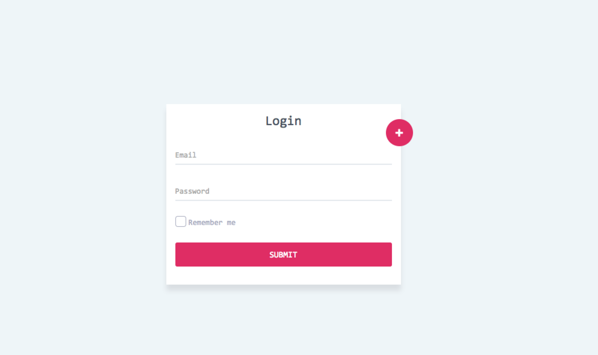
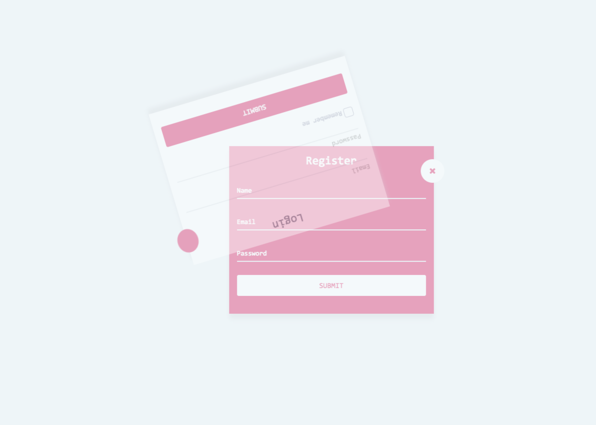
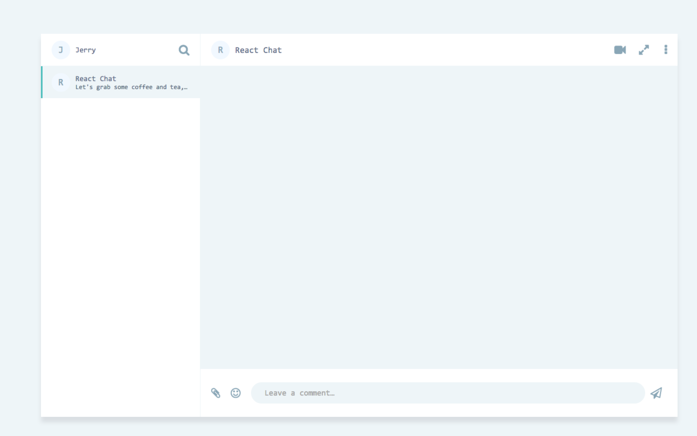
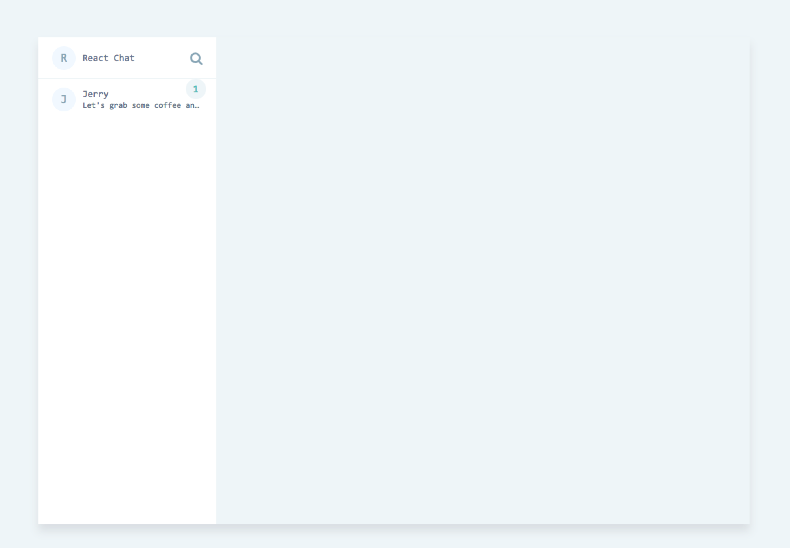
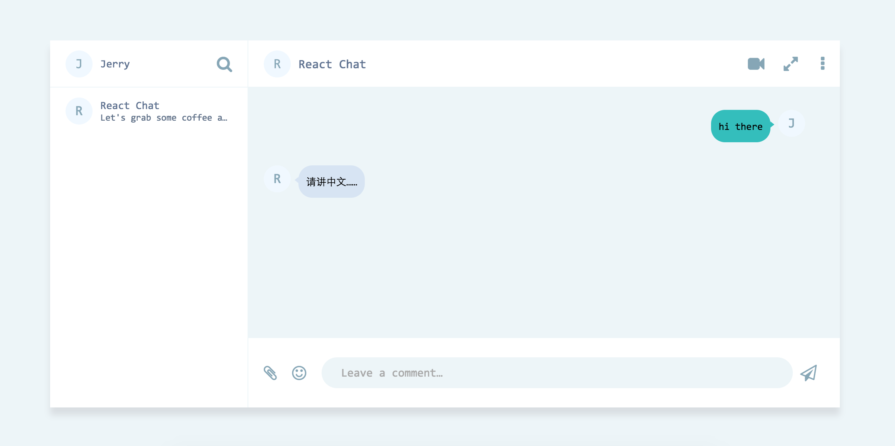
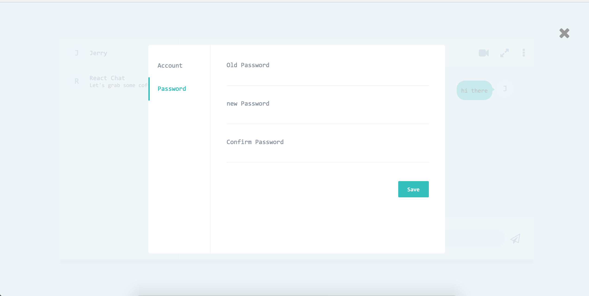

#Chat

> 开发中。

node, koa2 + socket.io + React

###安装  node >= 6.0

    git clone https://github.com/tangdaohai/chat
    npm install

###写在前面

这是一个使用了 koa2 全家桶与 react 全家桶的一个聊天项目.
后期打算加入 vue 与 ng2 模块的方式.

对于此项目的架构我深深考虑, 揣摩了好多次, 如果你有什么好建议欢迎发我邮箱进行讨论.

如果有任何关于这个项目的问题请随时 isssues.

> ps: 特别声明, 关于 React 端的 UI 资源全部来自于 [dribbble](https://dribbble.com).
感谢设计师们……

登陆: [https://dribbble.com/shots/3043497-Login-Register/attachments/638824](https://dribbble.com/shots/3043497-Login-Register/attachments/638824)

chat: [https://dribbble.com/shots/3136091-Chat-Web-App/attachments/664059](https://dribbble.com/shots/3136091-Chat-Web-App/attachments/664059)

设置: [https://dribbble.com/shots/2864249-Account-settings/attachments/590588](https://dribbble.com/shots/2864249-Account-settings/attachments/590588)

###启动之前的准备

##### * 依赖: mongodb 这个是最重要的, 需要创建为项目创建一个 chat 的数据库, 然后为这个数据库添加一个有读写权限的账号, 在配置中修改为你的账号. `server/configure/ 在这个目录下`

* pm2 倒不是必须的, 没有pm2也可以启动只不过不是后台运行而已……

* 内置了 webpack 的运行命令所以webpack 也不是必须的

* gulp 如果你想使node拥有热启动的超能力(`nodemon这个插件有这能力`),需要全局安装 gulp(`npm install -g gulp 注意是否需要 sudo`),需要使用 nodemon 作为启动入口.
  当然也可以直接使用`npm run prod`来启动项目,一样的.

###启动项目
```
    //npm 命令说明
    npm start   //对 gulp 有依赖
    npm run dev
    //这两个都是启动开发模式, 开发者模式在 koa 中集成了 webpack 与 热替换模块, 所以这个模式下面不会生成实体 js,css 与 html 文件, 到在 webpack 管理的内存中存放.

    npm run prod //启动线上环境部署(也没什么线上的配置……都一样的……😓)
    npm run pm2 //将进程托管给pm2, 此模式会一直在后台运行
    //这两个都是线上配置模式, 区别也只是在与 webpack 的配置. 会进行 js,css 分离,压缩,md5戳. html 也会自动压缩,会自动添加 js,css 路径

    npm run build //按照线上部署模式进行打包.
```

### 关于 css 布局

react 中的所有布局方式为 flex + position, 正在慢慢在细节上添加一些动画. 对 css 研究不深,所以关于 css 方面可能处理的并不优雅, 欢迎指点……

###部分截图(再次感谢 dribble 上设计师们……)

1. 登陆



2. 登陆与注册间的动画



3. chat 界面





4. setting 比较简陋……



> 未完待续……


